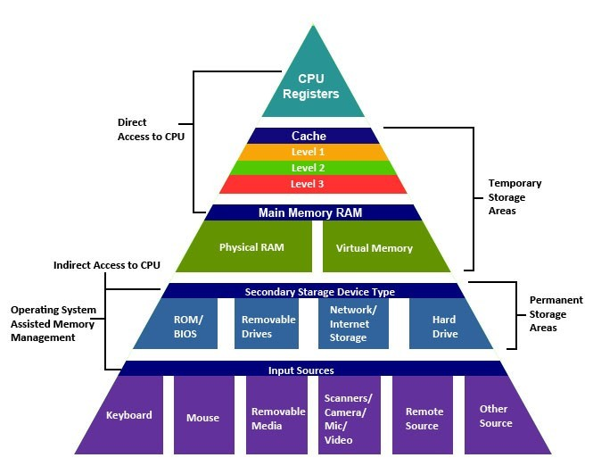

# 20230621
## 주제
    OS(운영체제)
## 참고자료
- [OPERATING SYSTEMS: CRASH COURSE COMPUTER SCIENCE #18](https://thecrashcourse.com/courses/operating-systems-crash-course-computer-science-18/)
- [3. Operating System](https://github.com/WeareSoft/tech-interview/blob/master/contents/os.md)

## 학습한 내용
- Multitasking
- Memory Allocation
- Memory Protection
- Physical Memory vs Virtual Memory
- 가상 메모리?
    - 가상 메모리를 사용하면 프로그램은 메모리가 항상 주소 0에서 시작되어 단순하고 일관되게 유지한다고 가정할 수 있다. 
- 동적 메모리 할당
- Unix
- MSDOS

- 운영체제란?
    - 프로그램들을 실행하는 메인 프로그램
- 운영체제는 어디에 있을까?
    - 운영체제는 ROM에 존재합니다.
    - PC가 작동하면 운영체제는 RAM에 올라가게 됩니다.
- 메모리의 계층 구조
    - 
    - 
- 커널의 역할
    - 하드웨어의 자원을 이용해 프로그램을 관리하는 역할을 한다.

- 프로세스
    - 뜻
        - 실행되고 있는 프로그램을 의미한다.
        - 메모리에 올라와 실행되고 있는 프로그램의 인스턴스
        - 실행된 프로그램
    - 프로그램 실행 정보/프로그래머가 작성한 코드/실행되면서 쓰이는 데이터로 구성되어 있다.

- 스레드
    - 뜻
        - 프로세스 내에서 실행되는 여러 흐름의 단위